# HomeCore — Arquitectura Técnica

> Documento de referencia para desarrolladores y administradores del sistema.
> Última actualización: marzo 2026.

---

## Tabla de contenidos

1. [Introducción y visión general](#1-introducción-y-visión-general)
2. [Hardware](#2-hardware)
3. [Acceso remoto](#3-acceso-remoto)
4. [Stack de software y decisiones de diseño](#4-stack-de-software-y-decisiones-de-diseño)
5. [Arquitectura de red y flujo de peticiones](#5-arquitectura-de-red-y-flujo-de-peticiones)
6. [Servicios Docker](#6-servicios-docker)
7. [Autenticación SSO en detalle](#7-autenticación-sso-en-detalle)
8. [HomeCore — arquitectura interna detallada](#8-homecore--arquitectura-interna-detallada)
9. [Base de datos](#9-base-de-datos)
10. [PWA](#10-pwa)
11. [Backups](#11-backups)
12. [Persistencia de datos](#12-persistencia-de-datos)
13. [Operación y mantenimiento](#13-operación-y-mantenimiento)
14. [Cómo añadir un nuevo servicio](#14-cómo-añadir-un-nuevo-servicio)

---

## 1. Introducción y visión general

HomeCore es un servidor doméstico privado que centraliza aplicaciones del hogar bajo un único punto de entrada seguro con autenticación unificada (SSO). Está diseñado para ser utilizado por toda la familia con acceso remoto global, manteniendo al mismo tiempo un modelo de seguridad sólido sin exponer puertos al exterior.

### Principios de diseño

- **Sin puertos abiertos**: el tráfico de entrada llega exclusivamente a través de un túnel Cloudflare cifrado de salida. La Raspberry Pi nunca escucha conexiones entrantes desde Internet.
- **SSO único**: todas las aplicaciones requieren autenticación a través de Authentik. No hay contraseñas independientes por servicio.
- **Todo en Docker**: cada servicio corre en un contenedor aislado. Un único `docker-compose.yml` define el sistema completo.
- **Datos en SSD externo**: el sistema operativo vive en la microSD; todos los datos, configuraciones y medios residen en el SSD USB. Esto simplifica backups y reemplazos de hardware.
- **Infraestructura como código**: la configuración de Caddy (Caddyfile), la composición de servicios (docker-compose.yml) y los scripts de backup están en el repositorio Git.

### Repositorio

```
https://github.com/TheIkaz/HomeCore-V2
```

Ubicación en la Raspberry Pi: `/srv/homecore/homecore/`

---

## 2. Hardware

| Componente | Detalle |
|---|---|
| Placa | Raspberry Pi 4 Model B |
| RAM | 8 GB LPDDR4 |
| Almacenamiento OS | MicroSD (solo sistema operativo) |
| Almacenamiento datos | SSD externo USB 1 TB (todos los datos, configs, media) |
| Sistema operativo | Raspberry Pi OS 64-bit (basado en Debian Bookworm) |

### Decisión de diseño: MicroSD vs SSD

La microSD tiene baja durabilidad ante escrituras intensas. Todo lo que se escribe frecuentemente (bases de datos, caché, media) está en el SSD. La microSD solo contiene el OS base y el runtime de Docker. Si la microSD falla, reinstalar el OS y montar el SSD restaura el sistema completo (junto con el proceso de restore de backups para los datos críticos).

---

## 3. Acceso remoto

El sistema expone servicios de dos formas distintas según el caso de uso:

### 3.1 Cloudflare Tunnel (acceso familiar general)

Cloudflare Tunnel establece una conexión TCP/TLS cifrada **de salida** desde la Raspberry Pi hacia los servidores de Cloudflare. Cloudflare actúa como proxy inverso externo: recibe las peticiones HTTPS de los usuarios y las reenvía al daemon `cloudflared` corriendo en Docker, que a su vez las entrega a Caddy.

**Ventajas clave:**
- No se abren puertos en el router doméstico. El firewall permanece cerrado.
- TLS termina en Cloudflare y se re-cifra hacia el túnel.
- El dominio `theikaz.com` y todos sus subdominios están gestionados en Cloudflare DNS.

**Subdominio asignado:** `*.theikaz.com`

El token del túnel se inyecta vía variable de entorno `CLOUDFLARE_TUNNEL_TOKEN`.

### 3.2 ZeroTier (administración por SSH)

ZeroTier crea una red VPN peer-to-peer overlay. Se utiliza exclusivamente para acceso SSH del administrador. No involucra tráfico de aplicaciones.

**IP de la Pi en la red ZeroTier:** `10.147.18.210`

Este canal es independiente del túnel Cloudflare; si Cloudflare tiene una incidencia, el administrador puede acceder igualmente por ZeroTier.

---

## 4. Stack de software y decisiones de diseño

| Capa | Tecnología | Justificación |
|---|---|---|
| Contenerización | Docker + Compose | Aislamiento, reproducibilidad, gestión declarativa |
| Proxy inverso | Caddy | TLS automático, sintaxis limpia, soporte nativo forward auth |
| Identity Provider | Authentik | SSO self-hosted, forward auth + OIDC, gestión de usuarios vía UI |
| Base de datos SSO | PostgreSQL 16 | Requerido por Authentik; robusto y bien soportado |
| Caché/broker SSO | Redis | Requerido por Authentik para sesiones y tareas asíncronas |
| Túnel externo | Cloudflare Tunnel | Sin puertos abiertos, gestión DNS integrada |
| VPN admin | ZeroTier | P2P, sin servidor propio, bajo mantenimiento |
| Streaming media | Jellyfin | Open source, OIDC nativo via plugin |
| Gestión archivos | Filebrowser | Ligero, soporta `--noauth` (auth delegada a Caddy) |
| App principal | Flask + React | Backend API REST; frontend SPA moderno |
| WSGI server | Gunicorn | Production-ready para Flask |
| Base de datos app | SQLite | Suficiente para inventario doméstico; sin infraestructura adicional |
| Build frontend | Vite | HMR rápido, output optimizado |
| Backups | Rclone + Google Drive | Sin coste adicional, cifrado, accesible remotamente |

---

## 5. Arquitectura de red y flujo de peticiones

Todos los servicios comparten una única red Docker bridge llamada `homecore`. La resolución de nombres entre contenedores usa los nombres de servicio de Docker Compose como hostnames DNS internos.

### 5.1 Flujo de una petición externa

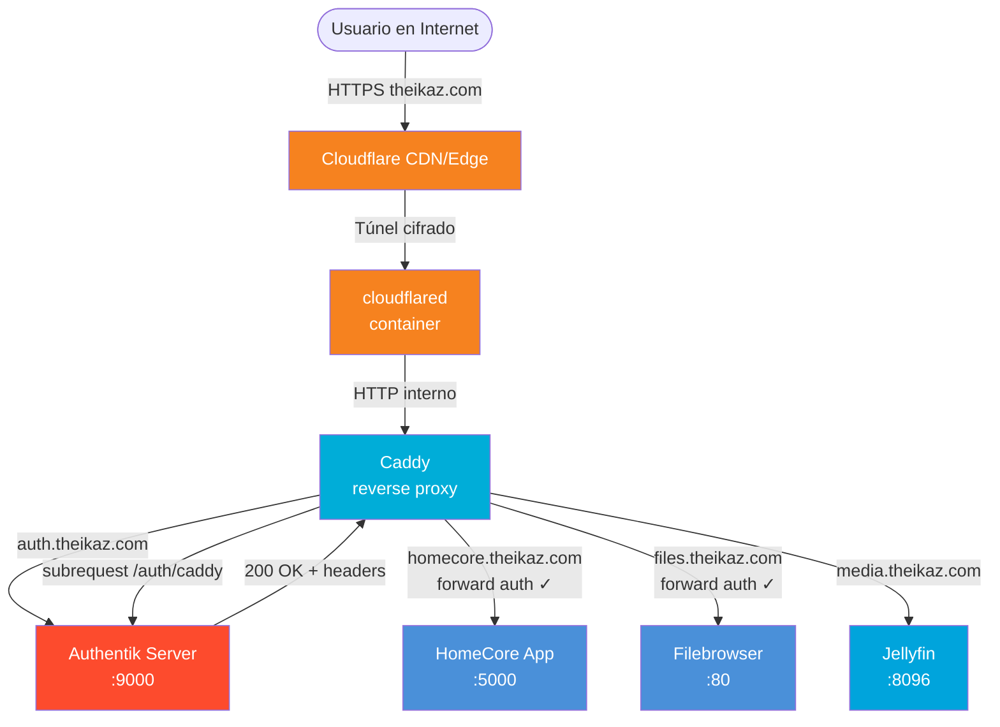

### 5.2 Flujo detallado con forward auth

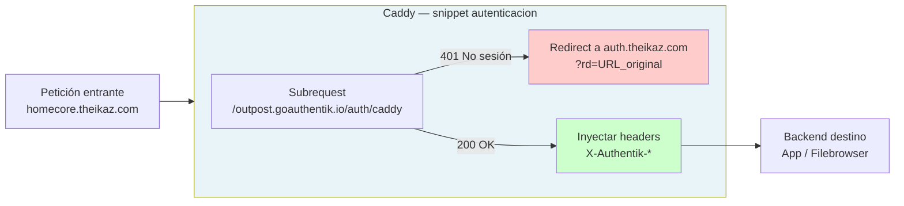

### 5.3 Acceso administrativo

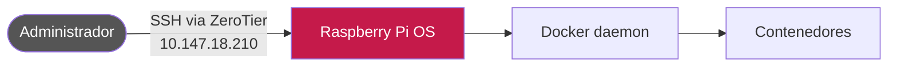

---

## 6. Servicios Docker

### 6.1 Diagrama de contenedores y dependencias

```mermaid
block-beta
    columns 3

    block:INFRA["Infraestructura SSO"]:1
        PG["homecore-postgresql\nPostgreSQL 16\n:5432"]
        REDIS["homecore-redis\nRedis\n:6379"]
        ASERVER["homecore-authentik-server\nAuthentik\n:9000"]
        AWORKER["homecore-authentik-worker\nAuthentik Worker"]
    end

    block:PROXY["Capa de acceso"]:1
        CLOUDFLARED["homecore-cloudflared\nCloudflare Tunnel"]
        CADDY["homecore-caddy\nCaddy\n:80/:443"]
    end

    block:APPS["Aplicaciones"]:1
        APP["homecore-app\nFlask+React\n:5000"]
        FB["homecore-filebrowser\nFilebrowser\n:80"]
        JF["homecore-jellyfin\nJellyfin\n:8096"]
    end

    PG --> ASERVER
    REDIS --> ASERVER
    PG --> AWORKER
    REDIS --> AWORKER
    CLOUDFLARED --> CADDY
    CADDY --> ASERVER
    CADDY --> APP
    CADDY --> FB
    CADDY --> JF
    ASERVER --> APP
```

### 6.2 Tabla de servicios

| Contenedor | Imagen base | Puerto interno | Función |
|---|---|---|---|
| `homecore-postgresql` | `postgres:16` | 5432 | Base de datos de Authentik |
| `homecore-redis` | `redis` | 6379 | Caché y broker de Authentik |
| `homecore-authentik-server` | `ghcr.io/goauthentik/server:2024.12.5` | 9000 | SSO — servidor principal |
| `homecore-authentik-worker` | `ghcr.io/goauthentik/server:2024.12.5` | — | SSO — worker de tareas |
| `homecore-caddy` | `caddy` | 80, 443 | Reverse proxy + TLS |
| `homecore-cloudflared` | `cloudflare/cloudflared` | — | Tunnel daemon |
| `homecore-filebrowser` | `filebrowser/filebrowser` | 80 | Gestor de archivos web |
| `homecore-jellyfin` | `jellyfin/jellyfin` | 8096 | Streaming de medios |
| `homecore-app` | Custom (Dockerfile) | 5000 | Aplicación principal HomeCore |

### 6.3 Red Docker

Todos los contenedores están conectados a la red bridge `homecore`. La comunicación entre servicios usa los nombres de contenedor como hostnames (ej.: `homecore-authentik-server`, `homecore-app`). No se exponen puertos al host excepto donde sea estrictamente necesario.

### 6.4 Enrutamiento de subdominios en Caddy

| Subdominio | Backend | Forward Auth | Notas |
|---|---|---|---|
| `auth.theikaz.com` | `authentik-server:9000` | No | El propio IdP no puede autenticarse a sí mismo |
| `homecore.theikaz.com` | `homecore-app:5000` | Sí | App principal |
| `files.theikaz.com` | `filebrowser:80` | Sí | Filebrowser corre con `--noauth` |
| `media.theikaz.com` | `jellyfin:8096` | No | Jellyfin gestiona su propia autenticación OIDC |

Caddy también envía el header `X-Forwarded-Proto: https` a Jellyfin para que los redirects internos usen HTTPS correctamente.

---

## 7. Autenticación SSO en detalle

El sistema utiliza dos mecanismos de autenticación distintos según el servicio:

1. **Forward Auth** (HomeCore App, Filebrowser): Caddy actúa como guardián; la sesión vive en Authentik.
2. **OIDC** (Jellyfin): Jellyfin gestiona el login directamente mediante el protocolo OpenID Connect con Authentik como proveedor.

### 7.1 Forward Auth — Flujo completo

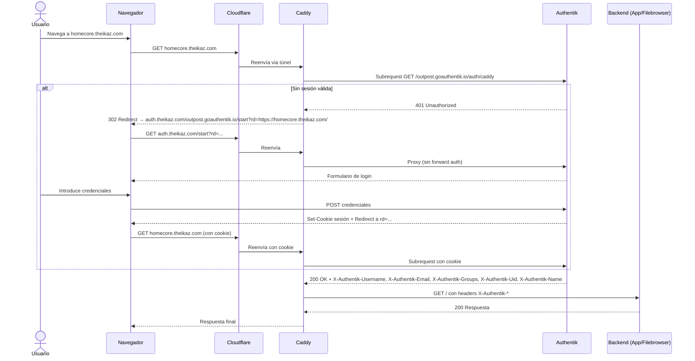

### 7.2 Snippet `autenticacion` en Caddyfile

El snippet centraliza la lógica de forward auth. Todos los sitios que requieren autenticación lo invocan con `import autenticacion`:

```
(autenticacion) {
    forward_auth homecore-authentik-server:9000 {
        uri /outpost.goauthentik.io/auth/caddy
        copy_headers X-Authentik-Username X-Authentik-Email X-Authentik-Name X-Authentik-Groups X-Authentik-Uid
        @authn_fail status 401
        handle_response @authn_fail {
            redir * https://auth.theikaz.com/outpost.goauthentik.io/start?rd={scheme}://{host}{uri} 302
        }
    }
}
```

### 7.3 OIDC (Jellyfin) — Flujo completo

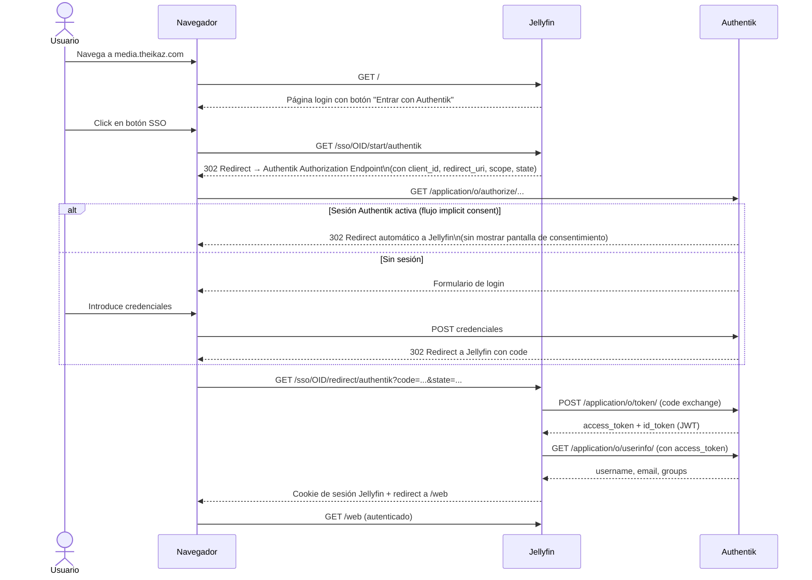

**Plugin utilizado:** `9p4/jellyfin-plugin-sso`

**Flujo de autorización Authentik:** `default-provider-authorization-implicit-consent`

Este flujo reutiliza la sesión existente de Authentik sin pedir confirmación adicional al usuario. Si el usuario ya ha iniciado sesión en `auth.theikaz.com`, el acceso a Jellyfin es transparente (un solo redirect).

### 7.4 Grupos y permisos

Los grupos se gestionan en Authentik y se propagan a las aplicaciones a través de los headers.

| Grupo (nombre) | Slug | Acceso |
|---|---|---|
| Familia | `familia` | HomeCore App, Filebrowser, Jellyfin, Mi cuenta |
| Admins | `admin` | Todo lo anterior + Administración, Invitar usuario, Estado Raspberry |

El header `X-Authentik-Groups` llega con el formato:

```
Familia|familia,Admins|admin
```

El backend de HomeCore parsea este header en `utils/auth.py`, extrae los slugs y determina el rol del usuario:

```python
def es_admin():
    grupos_header = request.headers.get("X-Authentik-Groups", "")
    slugs = [entry.split("|")[1] for entry in grupos_header.split(",") if "|" in entry]
    return "admin" in slugs
```

### 7.5 Sesiones

Las sesiones de Authentik están configuradas en el Login Stage `default-authentication-login`:

- **Duración de sesión:** 30 días
- **Remember me offset:** 30 días

Un usuario que marque "Recuérdame" mantendrá su sesión activa durante 30 días sin necesidad de volver a autenticarse.

---

## 8. HomeCore — arquitectura interna detallada

La aplicación HomeCore es un monolito Flask+React servido desde un único contenedor Docker. El frontend es una SPA (Single Page Application) compilada con Vite y servida como archivos estáticos por Flask.

### 8.1 Estructura del proyecto

```
homecore-app/
├── wsgi.py                    # Entry point Gunicorn
├── api/
│   ├── app.py                 # create_app() — factory de Flask
│   ├── blueprints/
│   │   ├── apps.py            # /api/apps
│   │   ├── inventario.py      # /api/inventario
│   │   ├── configuracion.py   # /api/configuracion
│   │   └── admin.py           # /api/admin
│   ├── database.py            # SQLite init + seed
│   └── utils/
│       └── auth.py            # Parsing de headers Authentik
├── web/
│   ├── src/
│   │   ├── main.jsx           # Entry point React + registro SW
│   │   ├── App.jsx            # Router principal
│   │   ├── api/               # Capa de API (fetch wrappers)
│   │   │   ├── client.js
│   │   │   ├── apps.js
│   │   │   ├── inventario.js
│   │   │   └── admin.js
│   │   ├── pages/
│   │   │   ├── Dashboard.jsx
│   │   │   ├── Inventario/
│   │   │   │   ├── InventarioInicio.jsx
│   │   │   │   ├── InventarioLista.jsx
│   │   │   │   ├── Agotados.jsx
│   │   │   │   └── ListaCompra.jsx
│   │   │   └── Admin/
│   │   │       ├── Invitar.jsx
│   │   │       └── Sistema.jsx
│   │   └── components/
│   │       ├── Layout.jsx
│   │       └── ConfirmDialog.jsx
│   ├── public/
│   │   ├── manifest.json      # PWA manifest
│   │   ├── sw.js              # Service Worker
│   │   └── icon.svg
│   ├── generate-icons.js      # Prebuild: genera icon-192/512.png con sharp
│   └── vite.config.js
├── Dockerfile                 # Multi-stage build
└── requirements.txt
```

### 8.2 Diagrama de arquitectura interna

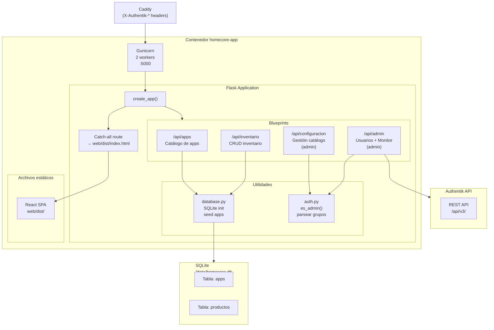

### 8.3 Flask — Blueprints en detalle

#### `apps_bp` — `/api/apps`

| Método | Ruta | Descripción |
|---|---|---|
| GET | `/catalogo` | Devuelve apps filtradas por grupos del usuario |

Lee el header `X-Authentik-Groups`, extrae los slugs de grupo, y retorna solo las apps cuyo campo `grupos` coincide con al menos uno de los grupos del usuario.

#### `inventario_bp` — `/api/inventario`

CRUD completo para los ítems del inventario doméstico.

| Método | Ruta | Descripción |
|---|---|---|
| GET | `/` | Lista todos los productos |
| POST | `/` | Crea un nuevo producto |
| PUT | `/<id>` | Actualiza un producto |
| DELETE | `/<id>` | Elimina un producto |
| PATCH | `/<id>/cantidad` | Ajusta la cantidad (+/-) |

#### `configuracion_bp` — `/api/configuracion`

Gestión del catálogo de aplicaciones. Protegido por `es_admin()`.

#### `admin_bp` — `/api/admin`

| Método | Ruta | Descripción |
|---|---|---|
| POST | `/invitar` | Crea usuario en Authentik via API |
| GET | `/sistema` | Métricas del sistema (CPU, RAM, disco, temperatura) |

**Flujo de creación de usuario (`POST /api/admin/invitar`):**

1. Llama a `GET /api/v3/core/groups/?slug=familia` para obtener el UUID del grupo
2. `POST /api/v3/core/users/` para crear el usuario
3. `POST /api/v3/core/groups/<uuid>/add_user/` para añadir al grupo
4. `POST /api/v3/core/users/<id>/set_password/` para establecer contraseña inicial

Requiere la variable `AUTHENTIK_API_TOKEN` en el entorno.

**Métricas del sistema (`GET /api/admin/sistema`):**

Usa la librería `psutil` para leer en tiempo real:
- CPU: porcentaje de uso
- RAM: usado (GB), total (GB), porcentaje
- Disco: usado (GB), total (GB), porcentaje
- Temperatura: lectura del sensor de la CPU de la Pi

### 8.4 React — Páginas y componentes

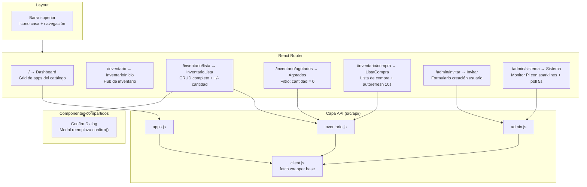

**Detalles de polling:**
- `ListaCompra`: `setInterval` cada 10 segundos para refrescar la lista automáticamente (útil cuando varios usuarios están de compras)
- `Sistema`: `setInterval` cada 5 segundos para métricas en tiempo real con sparklines

### 8.5 Catch-all route y React Router

Flask está configurado con `static_folder=None`. Esto evita que Flask intercepte rutas como `/assets/` o cualquier path que coincida con archivos estáticos antes de llegar al catch-all.

La ruta catch-all al final de `app.py` captura todo lo que no es una ruta `/api/*` y sirve `web/dist/index.html`. Esto permite que React Router gestione la navegación del lado del cliente, incluyendo recargas directas (hard refresh) en rutas como `/inventario/lista`.

### 8.6 Dockerfile — Build multi-stage

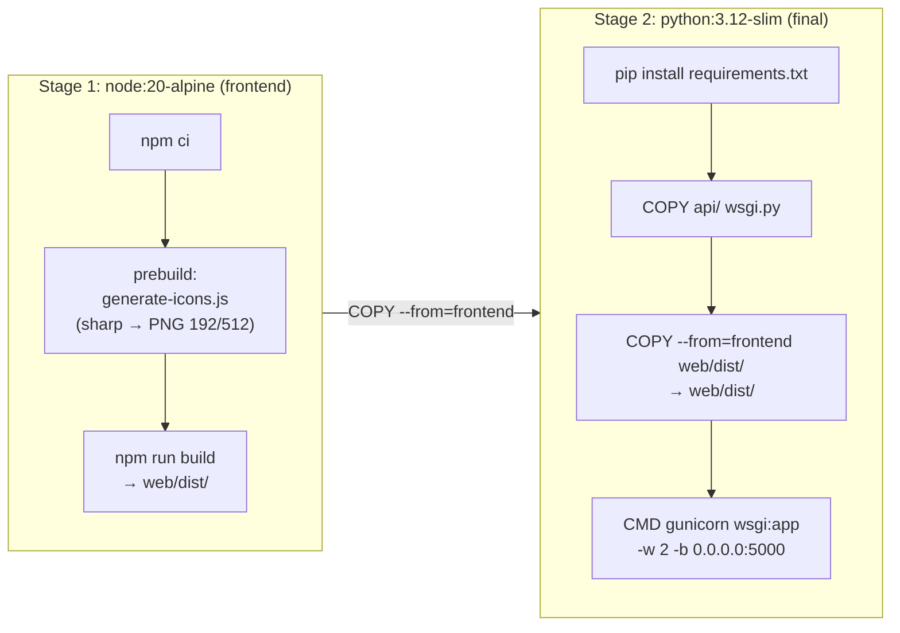

El stage de Node no llega a la imagen final; solo se copia el directorio `dist/`. La imagen final es exclusivamente Python, lo que mantiene el tamaño reducido.

---

## 9. Base de datos

### 9.1 SQLite — HomeCore App

**Ubicación:** `/data/homecore.db` dentro del contenedor, mapeada a `/srv/homecore/homecore/homecore/data/homecore.db` en el SSD.

#### Tabla `apps`

Catálogo de aplicaciones mostradas en el Dashboard.

| Columna | Tipo | Descripción |
|---|---|---|
| `id` | INTEGER PK | Identificador único |
| `nombre` | TEXT | Nombre visible de la app |
| `descripcion` | TEXT | Descripción breve |
| `url` | TEXT | URL de acceso (interna o externa) |
| `icono` | TEXT | Nombre del icono o emoji |
| `grupos` | TEXT | Grupos con acceso (slugs separados por coma) |
| `orden` | INTEGER | Orden de aparición en el grid |

**Seed inicial:** Se ejecuta automáticamente en el arranque de Flask si la tabla `apps` está vacía. Popula el catálogo con las aplicaciones por defecto del sistema.

#### Tabla `productos`

Inventario doméstico.

| Columna | Tipo | Descripción |
|---|---|---|
| `id` | INTEGER PK | Identificador único |
| `nombre` | TEXT | Nombre del producto |
| `cantidad` | INTEGER | Cantidad actual en stock |
| `cantidad_minima` | INTEGER | Umbral para lista de compra |
| `categoria` | TEXT | Categoría del producto |
| `unidad` | TEXT | Unidad de medida (uds, kg, l...) |
| `notas` | TEXT | Notas adicionales |

**Lógica de lista de compra:** Un producto aparece en la lista de compra cuando `cantidad <= cantidad_minima`. La vista "Agotados" filtra por `cantidad = 0`.

### 9.2 PostgreSQL — Authentik

Gestionado completamente por Authentik. No se accede directamente. Los datos críticos son:
- Usuarios, grupos y políticas de acceso
- Flujos de autenticación configurados
- Aplicaciones y providers OIDC/proxy registrados

La base de datos se llama según `AUTHENTIK_DB_NAME` (variable de entorno). El backup se realiza con `pg_dump`.

---

## 10. PWA

La aplicación HomeCore implementa Progressive Web App para permitir instalación en dispositivos móviles y escritorio con experiencia nativa.

### 10.1 Manifest

**Archivo:** `web/public/manifest.json`

Define la identidad de la PWA: nombre, colores de tema, modo de display (`standalone` — sin barra del navegador), y referencias a los iconos.

Los iconos se generan en tiempo de build mediante `generate-icons.js` usando la librería `sharp`, que convierte `icon.svg` en:
- `icon-192.png` — para pantallas estándar
- `icon-512.png` — para pantallas de alta resolución y splash screens

El `icon.svg` es una casa SVG simple, coherente con la identidad visual de HomeCore.

### 10.2 Service Worker

**Archivo:** `web/public/sw.js`

**Cache version:** `homecore-v2`

El service worker implementa una estrategia dual:

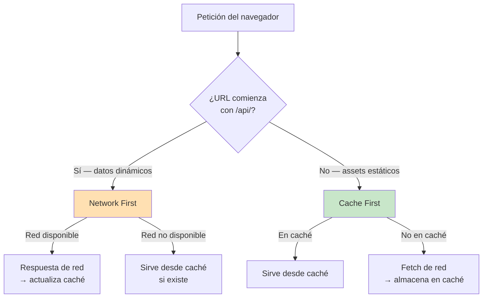

**Estrategia Network First para `/api/`:** garantiza datos actualizados en condiciones normales. Funciona offline mostrando el último estado conocido.

**Estrategia Cache First para assets:** los archivos JS, CSS e imágenes se sirven instantáneamente desde caché tras la primera visita. Solo se re-descargan cuando cambia la versión de caché.

### 10.3 Registro del Service Worker

El SW se registra en `main.jsx` durante la inicialización de React:

```javascript
if ('serviceWorker' in navigator) {
    window.addEventListener('load', () => {
        navigator.serviceWorker.register('/sw.js');
    });
}
```

El `index.html` incluye el `<link rel="manifest">` y los meta tags de tema correspondientes.

---

## 11. Backups

### 11.1 Estrategia general

| Parámetro | Valor |
|---|---|
| Herramienta | Rclone |
| Destino remoto | Google Drive (`gdrive:HomeCore-backups`) |
| Frecuencia | Semanal — domingos a las 03:00 |
| Retención | 4 semanas (backups más antiguos se eliminan) |
| Script principal | `scripts/backup.sh` |
| Script de restore | `scripts/restore.sh` |

### 11.2 Qué se incluye en el backup

| Dato | Método | Justificación |
|---|---|---|
| Base de datos Authentik | `pg_dump` | Usuarios, grupos, flujos, providers |
| Base de datos HomeCore | Copia directa SQLite | Catálogo de apps, inventario |
| Configuración Jellyfin | Copia directa del directorio | Settings, usuarios locales, plugins |
| Caddyfile | Copia directa | Configuración del proxy |

### 11.3 Qué se excluye

| Dato | Razón |
|---|---|
| Media de Jellyfin (películas, series) | Archivos originales conservados localmente; demasiado voluminosos para Google Drive |
| Caché de Jellyfin | Regenerable automáticamente |
| Logs de contenedores | No son críticos para un restore |

### 11.4 Proceso de backup

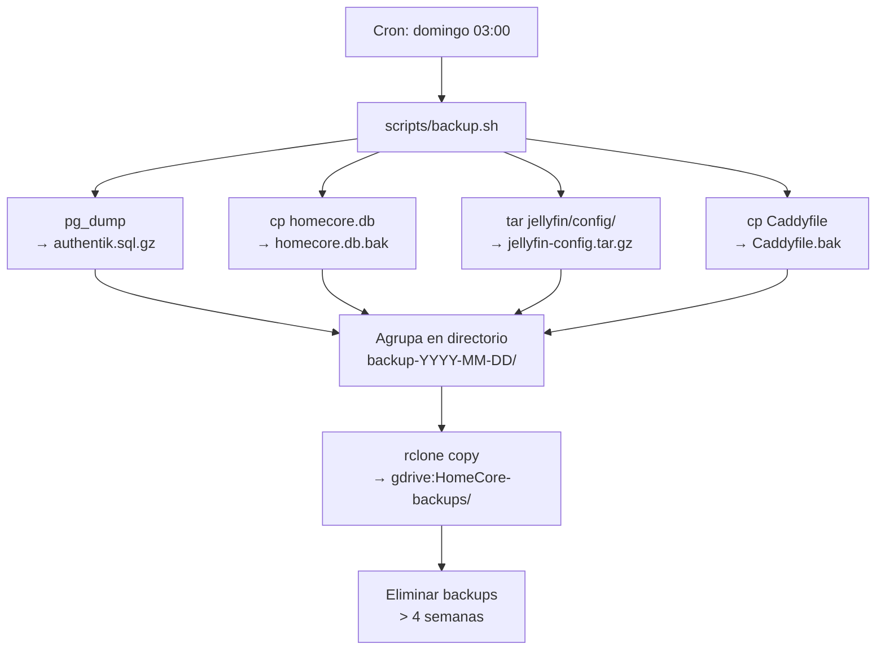

### 11.5 Proceso de restore

`scripts/restore.sh` es un script interactivo que:

1. Lista los backups disponibles en `gdrive:HomeCore-backups/`
2. El operador selecciona el backup deseado
3. Descarga el paquete del backup seleccionado
4. Detiene los contenedores afectados
5. Restaura `pg_dump` en PostgreSQL
6. Copia SQLite al destino correcto
7. Restaura configs de Jellyfin y Caddy
8. Reinicia los contenedores

### 11.6 Consideraciones

- El remote `gdrive` de Rclone debe estar autenticado previamente con `rclone config`. Las credenciales OAuth de Rclone se almacenan en la Pi (fuera del repositorio Git).
- En caso de pérdida total del hardware, el proceso de recuperación completo implica: nueva Pi + OS → montar SSD → instalar Docker → `git clone` del repo → `rclone` restore → `docker compose up`.

---

## 12. Persistencia de datos

Todos los datos persistentes residen en el SSD externo bajo `/srv/homecore/`. El directorio base del proyecto en la Pi es `/srv/homecore/homecore/`.

### 12.1 Mapa de volúmenes

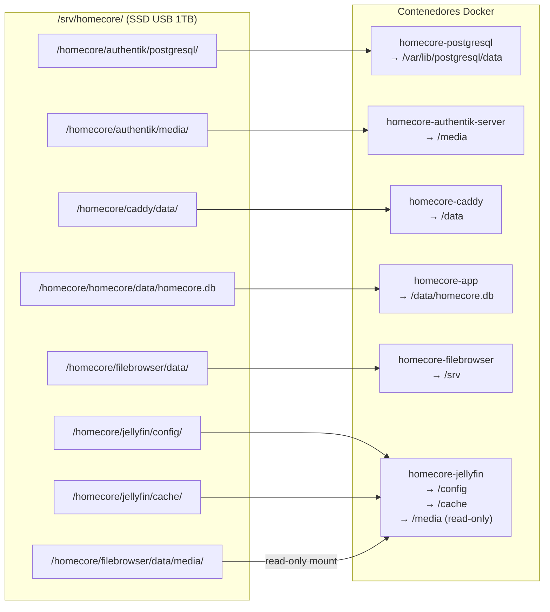

### 12.2 Tabla completa de rutas

| Servicio | Ruta en SSD | Montaje en contenedor | Notas |
|---|---|---|---|
| PostgreSQL | `/srv/homecore/homecore/authentik/postgresql/` | `/var/lib/postgresql/data` | Datos de Authentik |
| Authentik media | `/srv/homecore/homecore/authentik/media/` | `/media` | Avatares, logos custom |
| Caddy | `/srv/homecore/homecore/caddy/data/` | `/data` | Certificados TLS, estado |
| HomeCore DB | `/srv/homecore/homecore/homecore/data/homecore.db` | `/data/homecore.db` | SQLite de la app |
| Filebrowser | `/srv/homecore/homecore/filebrowser/data/` | `/srv` | Archivos gestionados |
| Filebrowser media | `/srv/homecore/homecore/filebrowser/data/media/` | `/media` (Jellyfin, RO) | Directorio compartido |
| Jellyfin config | `/srv/homecore/homecore/jellyfin/config/` | `/config` | Config + plugins |
| Jellyfin cache | `/srv/homecore/homecore/jellyfin/cache/` | `/cache` | Thumbnails, índices |

### 12.3 Relación Filebrowser — Jellyfin

El directorio `media/` dentro del espacio de Filebrowser se monta **en modo read-only** en el contenedor de Jellyfin como su biblioteca de medios. Esto permite:

- Subir archivos a `files.theikaz.com` y que aparezcan automáticamente en Jellyfin.
- Jellyfin no puede modificar ni eliminar los archivos originales (protección por read-only mount).

### 12.4 Variables de entorno

El archivo `.env` **no está en el repositorio Git**. Vive en la Pi en `/srv/homecore/compose/.env`. El repositorio contiene una plantilla en `compose/docker-compose.example.env`.

Variables clave:

| Variable | Uso |
|---|---|
| `DOMINIO` | Dominio base (theikaz.com) |
| `AUTHENTIK_SECRET_KEY` | Clave secreta de Authentik |
| `AUTHENTIK_DB_*` | Credenciales PostgreSQL |
| `AUTHENTIK_BOOTSTRAP_*` | Usuario admin inicial |
| `CLOUDFLARE_TUNNEL_TOKEN` | Token del túnel Cloudflare |
| `AUTHENTIK_API_TOKEN` | Token para la API de Authentik (usado por HomeCore App) |

---

## 13. Operación y mantenimiento

### 13.1 Comandos de deploy

**Contexto importante:** Docker Compose debe ejecutarse siempre con rutas absolutas para que los volúmenes con rutas relativas en el `docker-compose.yml` se resuelvan correctamente desde la ubicación del archivo compose.

**Deploy completo de la app HomeCore** (incluye rebuild de imagen):

```bash
cd /srv/homecore/homecore && git pull && \
docker compose \
  -f compose/docker-compose.yml \
  --env-file /srv/homecore/compose/.env \
  up -d --build homecore
```

**Reiniciar un servicio específico:**

```bash
docker compose \
  -f /srv/homecore/homecore/compose/docker-compose.yml \
  --env-file /srv/homecore/compose/.env \
  restart <nombre-servicio>
```

**Ver logs de un servicio:**

```bash
docker compose \
  -f /srv/homecore/homecore/compose/docker-compose.yml \
  --env-file /srv/homecore/compose/.env \
  logs -f <nombre-servicio>
```

**Bajar todos los servicios:**

```bash
docker compose \
  -f /srv/homecore/homecore/compose/docker-compose.yml \
  --env-file /srv/homecore/compose/.env \
  down
```

**Subir todos los servicios:**

```bash
docker compose \
  -f /srv/homecore/homecore/compose/docker-compose.yml \
  --env-file /srv/homecore/compose/.env \
  up -d
```

### 13.2 Problemas conocidos y soluciones

#### Subdominio en blanco tras `git pull` con cambios en Caddyfile

**Síntoma:** Una o más páginas cargan en blanco o con error tras actualizar el Caddyfile.

**Causa:** Docker reutiliza el contenedor de Caddy con el inode anterior del archivo de configuración. Caddy no detecta el cambio del archivo si el inode cambia (lo cual ocurre cuando `git pull` reemplaza el archivo en lugar de modificarlo in-place).

**Solución:**

```bash
docker compose \
  -f /srv/homecore/homecore/compose/docker-compose.yml \
  --env-file /srv/homecore/compose/.env \
  up -d --force-recreate caddy
```

`--force-recreate` fuerza la recreación completa del contenedor, montando el nuevo archivo desde cero.

#### Jellyfin no redirige a HTTPS correctamente

**Causa:** Jellyfin genera redirects internos basados en el protocolo detectado. Si no recibe el header `X-Forwarded-Proto: https`, asume HTTP y genera URLs incorrectas.

**Solución:** Caddy añade explícitamente `header_up X-Forwarded-Proto https` en el bloque `media.theikaz.com`.

### 13.3 Actualizar Authentik

1. Cambiar la versión en `docker-compose.yml` (tag de imagen)
2. Hacer pull de la nueva imagen: `docker compose pull authentik-server authentik-worker`
3. Recrear los contenedores: `docker compose up -d authentik-server authentik-worker`
4. Authentik ejecuta migraciones de base de datos automáticamente al arrancar

### 13.4 Gestión de certificados TLS

Caddy gestiona TLS automáticamente. Los certificados se renuevan sin intervención manual y se almacenan en `/srv/homecore/homecore/caddy/data/`. No se requiere ninguna acción periódica.

Sin embargo, dado que el tráfico externo pasa por Cloudflare, el certificado visible para los usuarios es el de Cloudflare. El certificado gestionado por Caddy es para el tramo interno túnel→Caddy.

---

## 14. Cómo añadir un nuevo servicio

Esta sección describe el proceso paso a paso para integrar un nuevo servicio (ej.: `nueva-app`) en el stack HomeCore con autenticación SSO.

### Paso 1: Añadir el contenedor a `docker-compose.yml`

```yaml
homecore-nueva-app:
  image: ejemplo/nueva-app:latest
  container_name: homecore-nueva-app
  restart: unless-stopped
  networks:
    - homecore
  volumes:
    - /srv/homecore/homecore/nueva-app/data:/data
```

Todos los servicios deben estar en la red `homecore` para que Caddy pueda alcanzarlos por nombre.

### Paso 2: Crear el directorio de datos en el SSD

```bash
mkdir -p /srv/homecore/homecore/nueva-app/data
```

### Paso 3: Añadir el subdominio en el Caddyfile

**Con forward auth** (la aplicación no gestiona auth propia):

```
nueva-app.theikaz.com {
    import autenticacion
    reverse_proxy homecore-nueva-app:<puerto>
}
```

**Sin forward auth** (la aplicación gestiona su propia autenticación, ej.: OIDC):

```
nueva-app.theikaz.com {
    reverse_proxy homecore-nueva-app:<puerto>
}
```

### Paso 4: Configurar el túnel Cloudflare

En el panel de Cloudflare Zero Trust:
1. Ir a Networks → Tunnels → HomeCore tunnel
2. Añadir una nueva Public Hostname:
   - Subdomain: `nueva-app`
   - Domain: `theikaz.com`
   - Service: `http://localhost:80` (Caddy escucha en el host)

### Paso 5: Registrar la aplicación en Authentik

Si se usa **forward auth**:
1. En Authentik Admin → Applications → Providers → Crear un nuevo Proxy Provider
2. Configurar como Forward auth (single application)
3. External Host: `https://nueva-app.theikaz.com`
4. Asociar con el outpost existente (`homecore-caddy`)

Si se usa **OIDC**:
1. Crear un OAuth2/OIDC Provider con el `redirect_uri` correcto
2. Crear la Application asociando el provider
3. Configurar las credenciales (client_id, client_secret) en las variables de entorno de la nueva app

### Paso 6: Añadir la app al catálogo de HomeCore

Insertar en la tabla `apps` de SQLite (o a través del panel de Administración en la interfaz web):

```sql
INSERT INTO apps (nombre, descripcion, url, icono, grupos, orden)
VALUES ('Nueva App', 'Descripción de la app', 'https://nueva-app.theikaz.com', 'icono', 'familia', 10);
```

El campo `grupos` debe contener los slugs de los grupos con acceso, separados por coma.

### Paso 7: Desplegar

```bash
cd /srv/homecore/homecore && git pull && \
docker compose \
  -f compose/docker-compose.yml \
  --env-file /srv/homecore/compose/.env \
  up -d
```

Si el Caddyfile fue modificado y los cambios no se reflejan, recrear Caddy:

```bash
docker compose \
  -f compose/docker-compose.yml \
  --env-file /srv/homecore/compose/.env \
  up -d --force-recreate caddy
```

### Paso 8: Verificar

1. Navegar a `https://nueva-app.theikaz.com`
2. Si forward auth: confirmar que redirige a Authentik login y que tras autenticarse llega al servicio
3. Si OIDC: confirmar el flujo completo de login
4. Verificar que el servicio aparece en el Dashboard de HomeCore para los grupos correctos

---

*Documento generado el 25 de marzo de 2026.*
