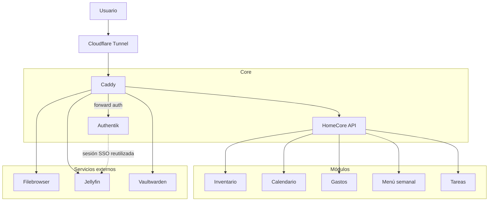

# HomeCore — Plataforma

**Versión 1.0 · Marzo 2026**

---

## 1. Definición

HomeCore es una plataforma doméstica privada que actúa como capa de identidad, API y orquestación de servicios del hogar. Centraliza el acceso a aplicaciones, gestiona la identidad de los usuarios y aloja módulos propios desarrollados a medida.

No es un dashboard de enlaces: es la capa activa sobre la que viven los módulos del hogar y desde la que se orquestan los servicios externos.

---

## 2. Arquitectura en capas

El sistema se organiza en tres capas con responsabilidades claramente diferenciadas.

```
┌─────────────────────────────────────────────────────────┐
│                        CORE                             │
│   Authentik (identidad)  ·  Caddy (gateway)             │
│   HomeCore API (orquestación)                           │
├─────────────────────────────────────────────────────────┤
│                      MÓDULOS                            │
│   Inventario  ·  Calendario  ·  Gastos                  │
│   Menú semanal  ·  Tareas del hogar                     │
├─────────────────────────────────────────────────────────┤
│                 SERVICIOS EXTERNOS                       │
│   Filebrowser  ·  Jellyfin  ·  Vaultwarden              │
└─────────────────────────────────────────────────────────┘
```

### Capa 1 — Core

El núcleo del sistema. Gestiona identidad, enruta el tráfico y expone la API central.

| Componente | Función |
|---|---|
| Authentik | Proveedor de identidad SSO. Gestión de usuarios, sesiones, grupos y MFA. |
| Caddy | Reverse proxy. Termina el tráfico del túnel Cloudflare, aplica forward auth y enruta hacia los servicios. |
| HomeCore API | Backend Flask. Orquesta los módulos, expone los endpoints y lee la identidad del usuario desde las cabeceras de Caddy. |

### Capa 2 — Módulos

Funcionalidades propias desarrolladas dentro de HomeCore. Cada módulo es un blueprint Flask en el backend y un conjunto de páginas React en el frontend. Los módulos comparten la misma base de datos SQLite y pueden integrarse entre sí.

| Módulo | Estado | Dominio |
|---|---|---|
| Inventario | ✅ Operativo | Hogar |
| Calendario | ✅ Operativo | Hogar |
| Gastos domésticos | 🔲 Pendiente | Hogar |
| Menú semanal | 🔲 Pendiente | Hogar |
| Tareas del hogar | 🔲 Pendiente | Hogar |

### Capa 3 — Servicios externos

Aplicaciones independientes desplegadas en Docker e integradas en HomeCore como tiles del dashboard. Cada servicio gestiona sus propios datos y ciclo de vida.

| Servicio | Función | Autenticación |
|---|---|---|
| Filebrowser | Explorador de archivos web | Forward auth (Caddy → Authentik) |
| Jellyfin | Streaming de media familiar | SSO vía OIDC (plugin 9p4) |
| Vaultwarden | Gestor de contraseñas | Auth propia (sin forward auth, por requisito de seguridad) |

---

## 3. Diagrama de arquitectura



---

## 4. Dominios funcionales

Los componentes del sistema se agrupan en dominios que comparten contexto.

### Identidad

Gestiona quién es el usuario, a qué grupos pertenece y qué puede ver.

- **Componentes:** Authentik, `utils/auth.py`, cabeceras `X-Authentik-*`
- **Principio:** HomeCore no tiene autenticación propia. Si una petición llega al backend, Caddy ya la validó con Authentik.

### Hogar

Módulos propios que modelan la vida doméstica diaria. Es el dominio central de HomeCore.

- **Componentes:** Inventario, Gastos, Menú semanal, Tareas, Calendario
- **Principio clave:** estos módulos no son independientes. Comparten datos y se desencadenan mutuamente. Ver sección 5.

### Almacenamiento y media

Servicios de contenido accesibles desde el dashboard. No son módulos de HomeCore sino servicios externos orquestados por el Core.

- **Componentes:** Filebrowser, Jellyfin
- **Nota:** Filebrowser comparte la carpeta `media/` con Jellyfin en solo lectura. Son el mismo volumen Docker.

---

## 5. Integraciones entre módulos

Los módulos del dominio Hogar están diseñados para interoperar. Las integraciones previstas, ordenadas por dependencia:

| Evento | Origen | Destino | Acción |
|---|---|---|---|
| Producto agotado | Inventario | Lista de compra | El producto aparece automáticamente en la lista |
| Compra completada | Lista de compra | Inventario | Suma las cantidades compradas al stock |
| Compra completada | Lista de compra | Gastos | Registra el gasto asociado a la compra |
| Menú generado | Menú semanal | Lista de compra | Añade los ingredientes necesarios a la lista |

Las integraciones que ya están implementadas:
- Inventario → Lista de compra (producto agotado): ✅ operativo
- Lista de compra → Inventario (compra completada): ✅ operativo

Las integraciones pendientes dependen de que los módulos destino (Gastos, Menú) estén implementados.

> Para el detalle técnico de estos flujos, ver `docs/arquitectura_tecnica.md` sección 15. Para las reglas formales de interacción entre módulos (propiedad de datos, eventos, acoplamiento), ver `docs/modelo_interaccion.md`.

---

## 6. Principios de diseño

- **Sin exposición de puertos.** Todo el tráfico entra por Cloudflare Tunnel. La Pi no acepta conexiones externas directas.
- **SSO único.** Un solo login da acceso a todos los servicios. Los módulos no tienen autenticación propia.
- **Datos locales.** Ningún dato personal sale de la infraestructura propia. Los backups a Google Drive son la única excepción, con retención controlada.
- **Módulos integrados, no aislados.** Los módulos del dominio Hogar comparten contexto y datos. La integración entre ellos es un objetivo de diseño, no un añadido posterior.
- **Infraestructura como código.** Caddyfile, docker-compose.yml y scripts de backup están en el repositorio Git. El sistema es reproducible desde cero.

---

## 7. Evolución del sistema

HomeCore ha seguido una progresión deliberada desde herramienta básica hasta plataforma integrada.

| Etapa | Descripción | Estado |
|---|---|---|
| MVP | Dashboard + catálogo de apps + SSO | ✅ Completado |
| Módulos básicos | Inventario + Calendario + PWA + Monitorización | ✅ Completado |
| Estabilidad | Backups, gestión de usuarios, persistencia de sesión | ✅ Completado |
| Plataforma doméstica | Gastos + Menú + Tareas integrados con Inventario | 🔄 En curso |

### Evolución técnica prevista

**Persistencia:** SQLite cubre las necesidades actuales y previsibles del caso de uso doméstico. Una migración a PostgreSQL solo tendría sentido si la concurrencia o el volumen de datos lo requieren, lo cual no está previsto en el horizonte actual.

**Arquitectura de servicios:** el monolito modular (un único proceso Flask con blueprints) es adecuado para una Pi 4 con uso familiar. Una separación en servicios independientes añadiría complejidad operativa sin beneficio real para este caso de uso.
